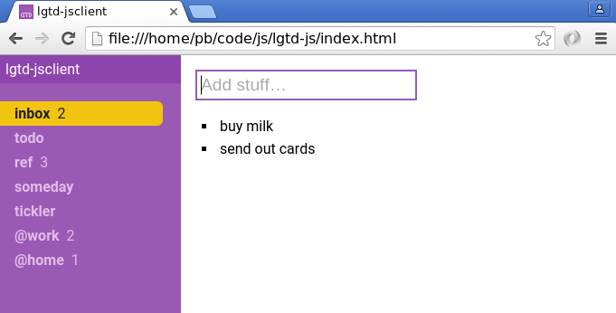
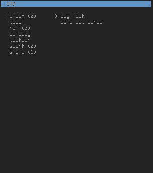
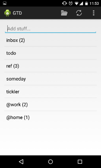

---------
lgtd-core
---------

Core components of ``lgtd-suite``, an implementation of David Allen's `Getting Things Done`__ (GTD) methodology with a focus on privacy and reliability.

By now there are certainly many tools that support a GTD-type workflow.
This project started many years ago because at the time I could not find any solution that met two critical requirements: privacy and a fully-functional offline mode.
(Oh, and I required platform independence.)
Given today's cloud landscape I suspect that privacy may still be a great concern.

With ``lgtd-suite`` all these concerns are addressed by offering a robust and lightweight synchronization protocol and employing strong end-to-end encryption and authentication.
The server portion of this implementation can be self hosted (in fact, you have to) and runs just fine in an untrusted environment without compromising privacy.

This repository contains ``lgtd-core``, the core components of ``lgtd-suite``. The entire suite offers:

 * End-to-end encryption and authentication
 * Fully-functional offline mode
 * Several user interfaces (ncurses, `browser`__, `mobile`__)

Installation
------------
Note that setting up the synchronization server is completely optional and can be done later as needed.

Client
======
Install through pip::

    pip install --user git+git://github.com/pb-/lgtd-core#egg=lgtd-core[client]

Run with::

    lgtd

On startup, the client will ask for the encryption passphrase. If you start the client for the first time, it will ask twice to confirm.

Server (optional)
=================
The easiest way to run the server is through Docker Compose and use the interactive setup script::

    git clone https://github.com/pb-/lgtd-core.git
    sudo lgtd-core/scripts/setup-server.sh

Follow the instructions of the script.

A note on security
------------------
``lgtd-suite`` uses authenticated encryption (256-bit AES-GCM) to store and transmit user data.
While this is fairly strong crypto, I urge you not to trust any cryptographic implementation until you gathered sufficient confidence in it, whatever that means to you.
You may want to read the source, ask a friend, perform a professional audit on it, etc.
I will not take any responsibility for any security issues you may encounter when using this software.
Having said that, I am happy to listen to any feedback you may have.

__ https://www.google.com/search?q=getting+things+done
__ https://github.com/pb-/lgtd-js
__ https://github.com/pb-/lgtd-android
